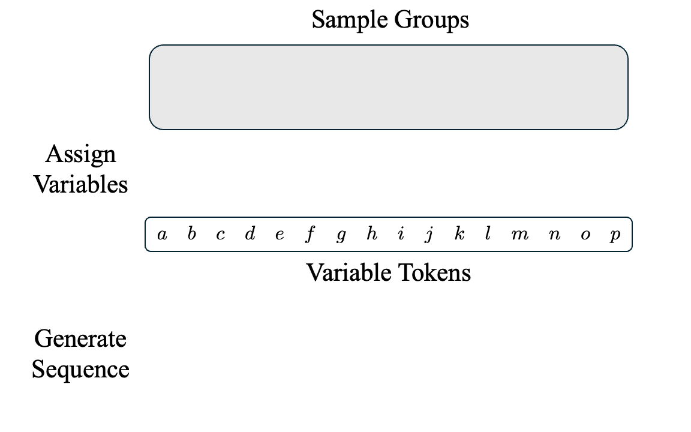
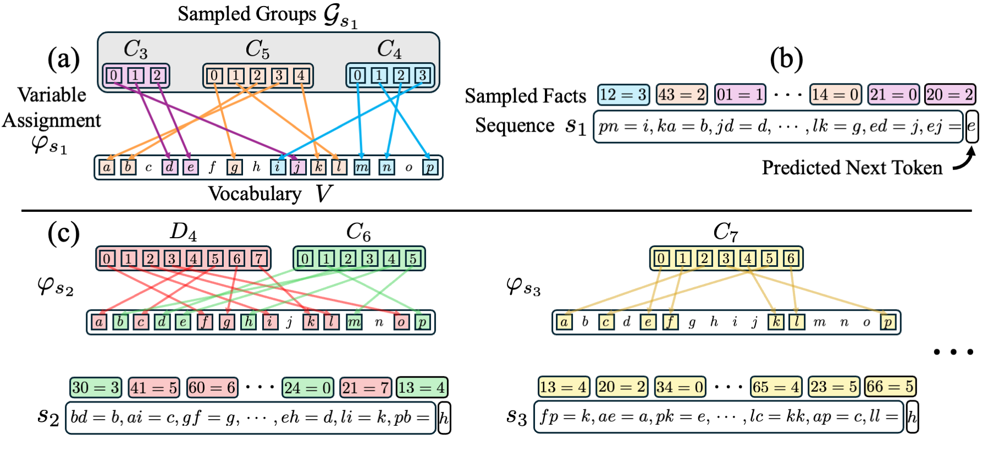

# In-Context Algebra

###  [Project Website](https://algebra.baulab.info) | [Arxiv Preprint](https://arxiv.org/abs/2512.16902) | [Models (Coming Soon!)] <br>

<div align='center'>
<!--  -->

</div>

## Setup

We use conda as a package manager. 
The environment used for this project can be found in `env/algebra.yml`.
To install, you can run: 
```
conda env create -f algebra.yml
conda activate algebra
```

## Data
<!-- At a high-level, the in-context algebra task involves simulating a mixture of finite algebraic groups.  -->
<!-- Our in-context algebra sequences are generated as a mixture of finite algebraic groups.  -->
More details about our data generating code can be found in the [`tasks`](/src/tasks) directory.

## Code
More details on code organization coming soon.


## Citing our work
This preprint can be cited as follows:

```bibtex
@misc{todd2025incontextalgebra,
    title={In-Context Algebra}, 
    author={Eric Todd and Jannik Brinkmann and Rohit Gandikota and David Bau},
    year={2025},
    eprint={2512.16902},
    archivePrefix={arXiv},
    primaryClass={cs.CL},
    url={https://arxiv.org/abs/2512.16902},
}
```
