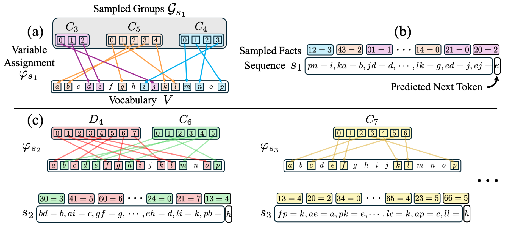

# In-Context Algebra

###  [Project Website](https://algebra.baulab.info) | [Arxiv Preprint](https://arxiv.org/abs/2512.16902) | [Models (Coming Soon!)] <br>

<div align='center'>
<!--  -->

</div>

## Setup

We use conda as a package manager. 
The environment used for this project can be found in `env/algebra.yml`.
To install, you can run: 
```
conda env create -f algebra.yml
conda activate algebra
```

## Code
Our code is split into two parts:

- The `experiments` directory contains notebooks with code for reproducing results/figures in the paper, including analysis of different mechanisms, empirical coverage, and model performance.

- The `src` directory contains the main codebase, with util files for  training models, data generation, experiments, and analysis.

## Data
The in-context algebra task involves simulating a mixture of finite algebraic structures. The models we analyze are trained on groups, but we test our models on non-group structures as well.
Our data-generating code + more details can be found in the [`src/tasks`](/src/tasks) directory.


## Models
#### Download Pre-Trained Algebra Models
You can download the model we analyze in our paper [here] (Link coming soon!)
<!-- [here](https://algebra.baulab.info/weights/). -->


#### Train Your Own Algebra Model
To train your own algebra model complete with checkpoints, you can use the `training.py` script (also check out the companion script `train_mix_10.sh`). We use `wandb` to keep track of training details, including logging metrics over time.


## Citing our work
This preprint can be cited as follows:

```bibtex
@misc{todd2025incontextalgebra,
    title={In-Context Algebra}, 
    author={Eric Todd and Jannik Brinkmann and Rohit Gandikota and David Bau},
    year={2025},
    eprint={2512.16902},
    archivePrefix={arXiv},
    primaryClass={cs.CL},
    url={https://arxiv.org/abs/2512.16902},
}
```
